# Project Name: Sustainability

Public Link: [Sustainability](https://kikispace.github.io/csen396bfinal_sustainability/)

To run the project:
```
npm install
npm run dev
```

## Team Members


## Mission

In modern times, our lives have become more convenient, and people's lifestyles are rapidly changing with technology. However, beneath the bright lights powered by our resources, many potential toxic side effects accompany this progress. That’s why we must all care about sustainability. It is a way to find balance for the world, achievable only if everyone gets involved.

## About this Study

We deploy data and deliver facts through powerful visualizations. Our goal is for everyone to gain valuable insights and form informed opinions based on our data.

## Dataset

We analyze hazard data from 1987 to 2022 using the United States Government database [Toxics Release Inventory (TRI)](https://catalog.data.gov/dataset/toxics-release-inventory-tri).

## Data Analysis

### Observation & Questions

We gathered data from TRI from 1987 to 2022. Each file includes 119 fields related to California's information on the release and waste management of over 800 toxic chemicals and toxic chemical categories as reported annually by facilities in certain industries as well as federal facilities. Based on this huge dataset, we first delved into the field study. Because many fields use professional vocabulary, we selected the fields we were most interested in: County, Chemicals, Production Ratio, Release Weight & Volume. Based on that, we raised our questions for analysis:

- Q1: Which California counties produce the most toxic waste?
- Q2: Which industries produce the most toxic waste?
- Q3: Which chemicals are most prevalent in each county and in California overall?
- Q4: Which chemicals pose the largest potential health risk to humans, and what are these health risks? How likely is exposure to these chemicals?
- Q5: Is there any trend in the amount of toxic waste being produced per year?
- Q6: How can facilities reduce the amount of chemicals they use?
### Data Cleaning

We dropped the unnecessary fields and kept only the fields we care about based on the questions above. We filtered the data and designed our visualizations below.

## Design Architecture
We developed a web application to effectively showcase our visualizations. The following diagram illustrates the overall design of our application, detailing the architecture and the interactions between various components.

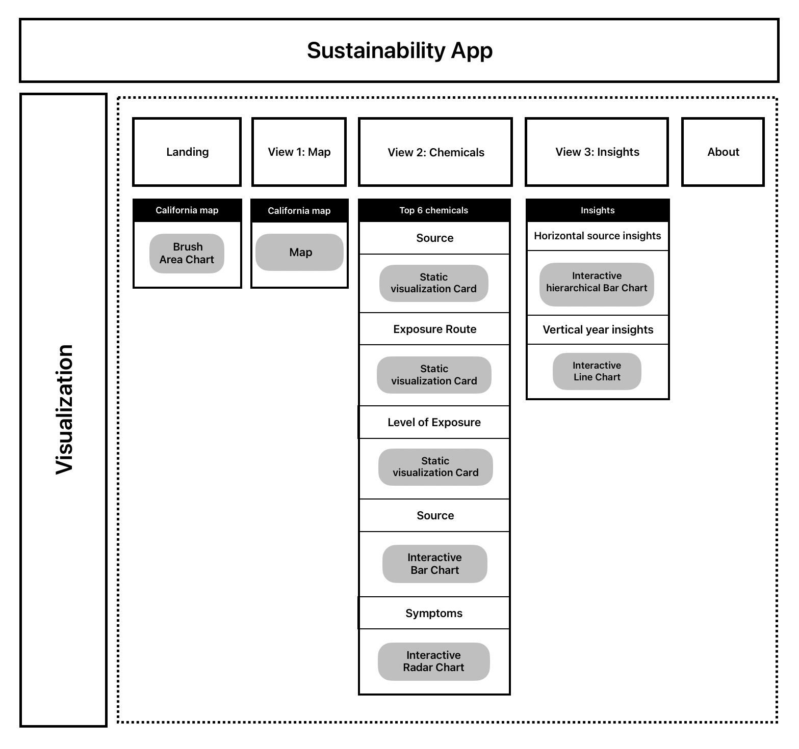

## Data Visualization

To answer the questions above, we created the following visualizations to better deliver insights from this hazard dataset.

### Landing - Brush Area Chart
The landing page is designed to deliver the context of our study and immerse our viewers in the questions we were considering. We achieve this by presenting the thought-provoking question, "Do you know how much toxic waste is produced around us?"

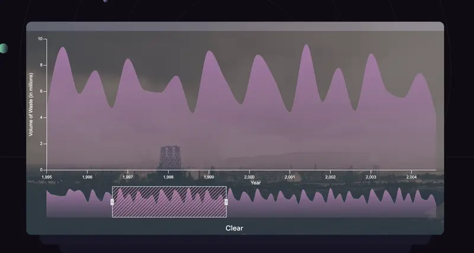

At the same time, we use a Brush Area Chart to help viewers explore the quantitative value of waste released over the years. Participants can **select a time interval** by brushing the overview area below and obtaining more detailed information in the top area. We chose this Brush Area Chart because it effectively shows both the overall data and details of smaller sections simultaneously. It is a powerful introductory visualization that allows viewers to gain more information interactively.

### View 1 (Q1, Q3) - Interactive Map:

We used an interactive map to visualize the toxic chemical release in California. We used **color** heat to visualize the weight. The **year** is configurable so it can select any year between 1987 and 2022 for a vertical analysis. If participants click a specific county, we have a **pop-up** showing the source of toxic release in this area.

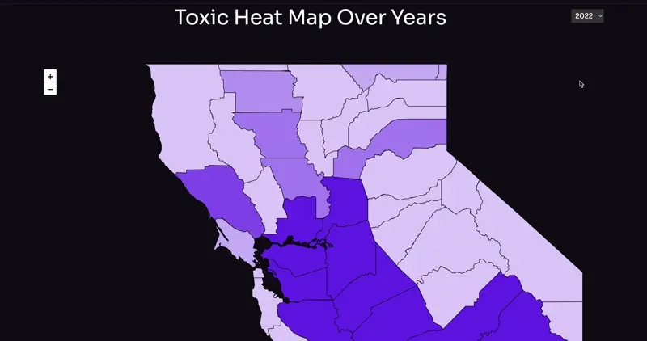

This interactive map lets participants easily navigate to the county they live in and get information about the level of toxic chemicals released in their area. It also provides rich information about the specific industry sources in those areas. It directly and highly engages participants, not only answering our initial questions **“Q1: Which California counties produce the most toxic waste?”** and **“Q3: Which chemicals are most prevalent in each county and in California overall?”** but also providing more context to help participants think about the problem.

### View 2 (Q2, Q4) - Infographic:

We present an interactive infographic visualization to provide information regarding chemicals. We selected the top 6 chemicals based on our analysis of the distribution of the top 6 chemicals compared to total chemicals. For each chemical, we list the source, exposure route, level of exposure, symptoms, and treatment as sub-tags.

For exposure route, level of exposure, and treatment, we use static visualization for quick reference.

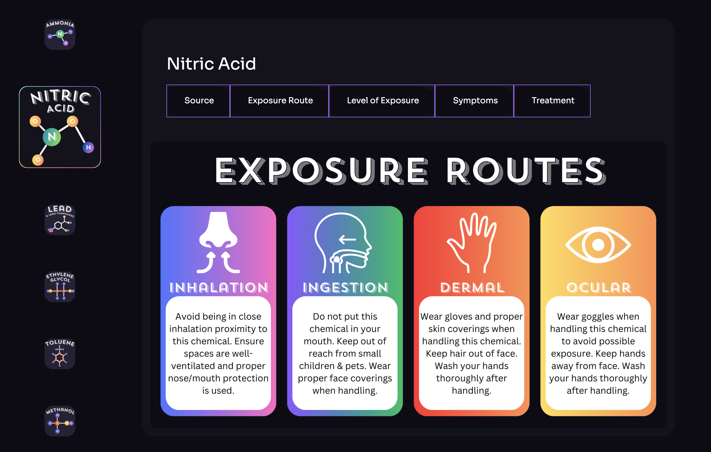

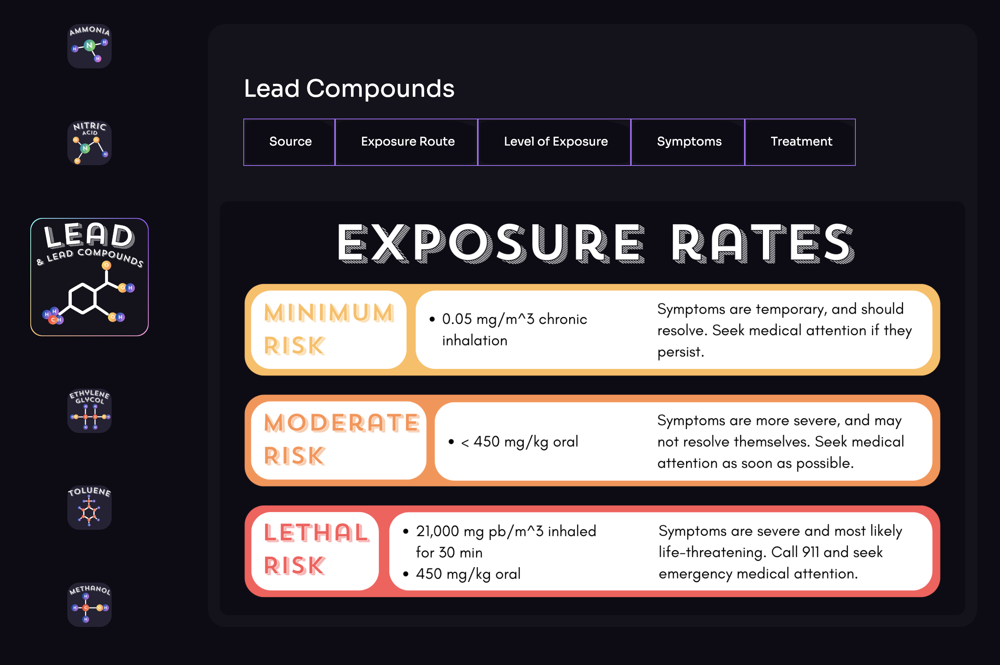

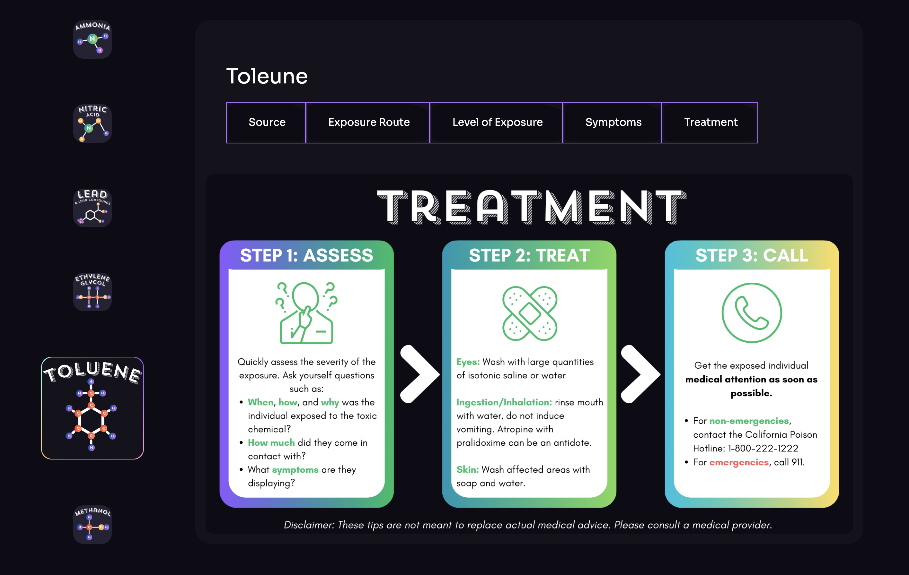

For the source, we use an interactive bar chart to clearly show the distribution of sources of toxic chemicals released.

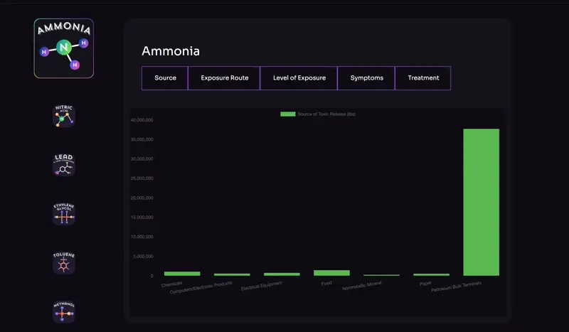

For symptoms, we use a radar chart to better deliver multivariate chemical information in a minimalist way, clearly showing the most common symptoms.

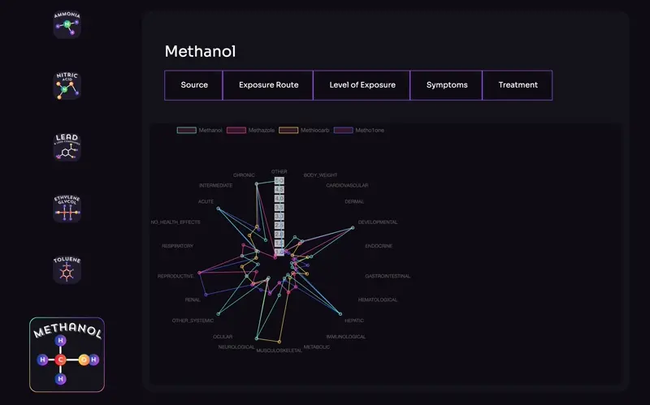

This rich infographic contains the most toxic chemicals released in California, as well as rich content regarding the source of each toxic release, how people get exposed, potential health risks, and treatment. It answers **“Q2: Which industries produce the most toxic waste?”** by listing the source, and it answers **“Q4: Which chemicals pose the largest potential health risk to humans, and what are these health risks? How likely is exposure to these chemicals?”** using the exposure and symptoms visualizations.

### View 3 (Q5) - Interactive Bar/Line Chart:

We first use an interactive bar chart to visualize the overall source of toxic release. By clicking each source, participants can interactively see the toxic chemicals released by specific industry sources. 

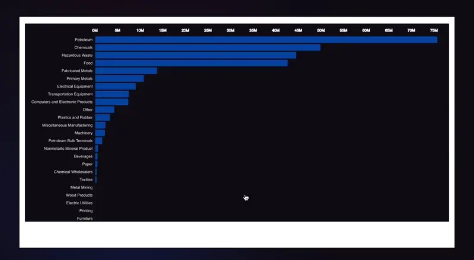

Following up, we use an interactive line chart to visualize the total toxic chemicals released over the years (weights) as well as the top 3 chemicals released over the years. This chart delivers more vertical insight to participants, helping them think about how chemical releases change over time.

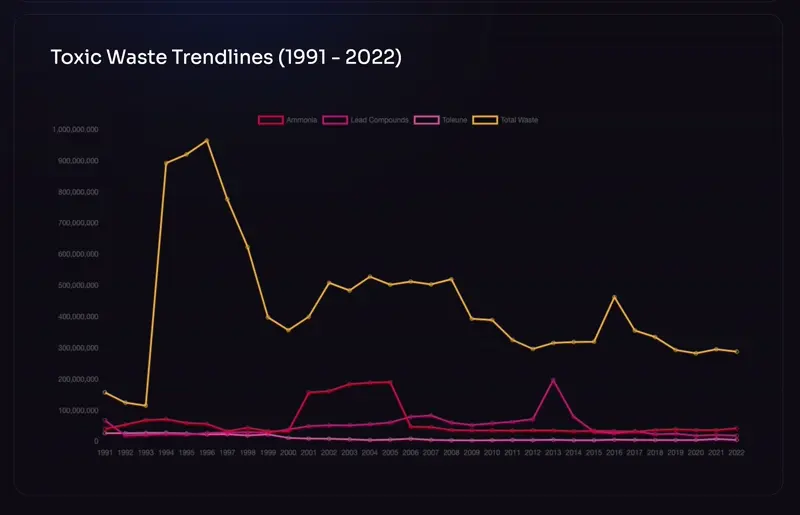

These two interactive charts deliver both horizontal and vertical insights regarding the trends of toxic chemical releases. They answer the question **“Q5: Is there any trend in the amount of toxic waste being produced per year?”** and inspire participants to think more deeply about the issue.

**“Q6: How can facilities reduce the amount of chemicals they use?”** is an open question we leave for discussion or consideration by any viewer of our site. By going through our visualization and data insights, we hope everyone notices how we are surrounded by toxic chemicals and why sustainability is needed for everyone.

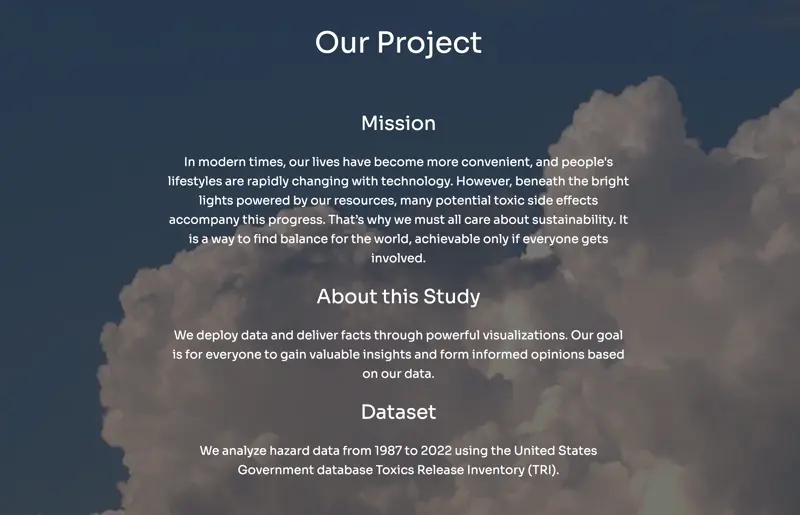

## Design Analysis and Aesthetic

We use a deep background and purple theme color to convey a chemical tone. However, at the end of our site, we use a blue sky and cloud background to deliver a positive tone, inspiring viewers to get involved in helping maintain our beautiful environment and engage in sustainability.

## Summary

This project leaves a deep impression on all our team members. At the same time, we hope everyone gains our insights. Toxic chemical release might affect everyone’s living conditions. Improvements can only happen if everyone makes small efforts in daily life. For example, the industry source category releasing the most chemicals is petroleum, which is why we need to use recyclable vehicles. Food and hazardous wastes also release many toxic chemicals in our daily lives, so further research on how to decrease toxic chemicals in daily usage is essential as well. Overall, this is a huge topic to dive into, and we hope more and more people are inspired by our project and get involved.
